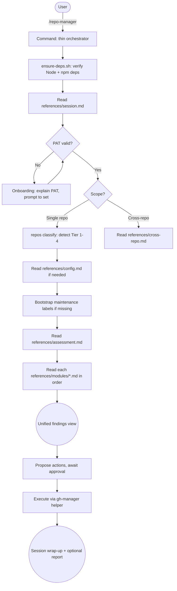

# github-repo-manager

Conversational GitHub repository maintenance: health auditing, wiki sync, PR triage, security posture, and community file management via PAT.

## Summary

github-repo-manager turns Claude Code into an interactive GitHub repository maintenance assistant. Invoke `/repo-manager`, tell it which repo (or repos) to look at, and it runs a structured health assessment across nine modules: security, releases, community files, PRs, issues, dependencies, notifications, discussions, and wiki. Findings surface in a single prioritized view; the plugin then proposes specific actions and waits for your approval before touching anything. Every mutation goes through the `gh-manager` helper CLI, a Node.js wrapper around the GitHub API. Sessions are scoped: the plugin activates on `/repo-manager` and exits cleanly when you're done, leaving no residual behavior.

## Principles

**No action without approval**: The plugin never mutates a repository without explicit owner approval during the session. It explains what it's about to do and why, then waits. The PreToolUse hook provides a mechanical enforcement layer that warns the agent before any write command runs.

**Fail transparently, succeed quietly**: Errors are surfaced in plain language with recovery options. Rate-limit warnings, permission gaps, and API failures are reported conversationally; the session never silently skips something consequential. Successful steps collapse to a single confirmation line.

**Tier-aware ceremony**: The plugin classifies each repo into one of four tiers (private/docs, private/code, public/no-releases, public/releases) and scales mutation strategy, explanation depth, and staleness thresholds to match. A private scratch repo gets batch approvals and brief summaries; a public repo with releases gets PRs for file changes and full diff review.

**Expertise-aware communication**: Default explanation level is beginner: GitHub concepts get explained on first mention, irreversible actions get flagged, and jargon gets translated. Owners can shift to intermediate or advanced mid-session, and persist the preference in the portfolio config.

## Requirements

- Claude Code (any recent version)
- Node.js 18 or later (for the `gh-manager` helper)
- `gh` CLI authenticated with `repo`, `read:org`, and `notifications` scopes (used by the helper)
- GitHub Personal Access Token (PAT) set as `GITHUB_PAT` in your environment
  - Classic PAT minimum scopes: `repo`, `notifications`
  - Fine-grained PATs: grant Repository read/write access for the target repos

## Installation

```
/plugin marketplace add L3DigitalNet/Claude-Code-Plugins
/plugin install github-repo-manager@l3digitalnet-plugins
```

For local development:

```bash
claude --plugin-dir ./plugins/github-repo-manager
```

### Post-Install Steps

1. Install helper dependencies (the plugin does this automatically on first `/repo-manager` invocation via `ensure-deps.sh`, but you can also run it manually):

   ```bash
   bash plugins/github-repo-manager/scripts/setup.sh
   ```

2. Set your GitHub PAT:

   ```bash
   export GITHUB_PAT=ghp_your_token_here
   ```

3. Verify authentication before your first session:

   ```bash
   node plugins/github-repo-manager/helper/bin/gh-manager.js auth verify
   ```

## How It Works



## Usage

Invoke the plugin with a natural-language request:

```
/repo-manager check my ha-light-controller repo
/repo-manager are any of my public repos missing a SECURITY.md?
/repo-manager what PRs need attention across my repos?
/repo-manager show me the security posture on owner/my-repo
```

**Session flow:**

1. The plugin determines scope (single-repo or cross-repo) from your request.
2. On first run, dependency checks, PAT verification, tier detection, and label bootstrapping all run silently and collapse to one confirmation line.
3. For a full assessment it runs all nine modules in order, emitting a progress line per module, then presents one consolidated findings view grouped by severity (critical / needs attention / healthy).
4. For each actionable finding it proposes a specific action and waits for your approval before executing.
5. At session end it summarizes actions taken and lists any deferred items. It can also generate a markdown report if you want one.

The plugin exits cleanly when you change topic or say you're done.

## Commands

| Command | Description |
|---------|-------------|
| `/repo-manager` | Activate a GitHub repository management session |

## References

Domain knowledge loaded on demand by the command. These files are never auto-loaded into context; they enter the conversation only when the command explicitly reads them.

| Reference | Purpose |
|-----------|---------|
| `session.md` | Session flow, tier system, communication style, error handling |
| `assessment.md` | Module execution order, cross-module deduplication, unified findings format |
| `command-reference.md` | `gh-manager` helper CLI syntax and available commands |
| `config.md` | Per-repo and portfolio configuration system |
| `cross-repo.md` | Cross-repository scope inference, batch mutations, portfolio scanning |
| `modules/security.md` | Security posture audit: Dependabot, code scanning, secret scanning, branch protection |
| `modules/release-health.md` | Release health: unreleased commits, CHANGELOG drift, release cadence |
| `modules/community-health.md` | Community health files: README, LICENSE, CODE_OF_CONDUCT, CONTRIBUTING, templates |
| `modules/pr-management.md` | PR triage: staleness, conflicts, review status, merge workflow |
| `modules/issue-triage.md` | Issue triage: labeling, linked PRs, stale issues |
| `modules/dependency-audit.md` | Dependency health via dependency graph and Dependabot PRs |
| `modules/notifications.md` | Notification processing with priority classification |
| `modules/discussions.md` | GitHub Discussions: unanswered questions, stale threads |
| `modules/wiki-sync.md` | Wiki content synchronization: clone, diff, generate, push |

## Hooks

| Hook | Event | What it does |
|------|-------|--------------|
| `gh-manager-guard.sh` | PreToolUse (Bash) | Detects `gh-manager` mutation commands about to run, emits a warning to the agent context to verify owner approval was given, and logs a pending entry to the audit trail at `~/.github-repo-manager-audit.log`. Non-blocking (exits 0). |
| `gh-manager-monitor.sh` | PostToolUse (Bash) | Watches `_rate_limit` in every `gh-manager` response and warns when the API budget drops below 300 (warning) or 100 (critical). Logs all completed non-dry-run mutations to the audit trail. |

Both hooks match only Bash tool calls and only when the command contains `gh-manager`. Dry-run invocations are always skipped. The mutation pattern lists in both scripts are kept in sync; if a new write command is added to the helper, both scripts must be updated.

## Planned Features

No unreleased items are currently tracked in the changelog.

## Known Issues

- Notification pagination is limited; the `notifications list` command does not paginate beyond the first page of results; large notification backlogs will be truncated.
- Wiki operations hardcode the `master` branch for git operations, which will fail on wikis that use `main` as the default branch.
- Fine-grained PATs cannot have their scopes verified via response headers; the `auth verify` command reports PAT type but cannot enumerate permissions for fine-grained tokens.
- The `config portfolio-write` command affects staleness thresholds and module behavior across all repos in the portfolio; running it without reviewing the current config first can silently change behavior for unrelated repos.

## Links

- Repository: [L3DigitalNet/Claude-Code-Plugins](https://github.com/L3DigitalNet/Claude-Code-Plugins)
- Changelog: [CHANGELOG.md](CHANGELOG.md)
- Issues: [GitHub Issues](https://github.com/L3DigitalNet/Claude-Code-Plugins/issues)
