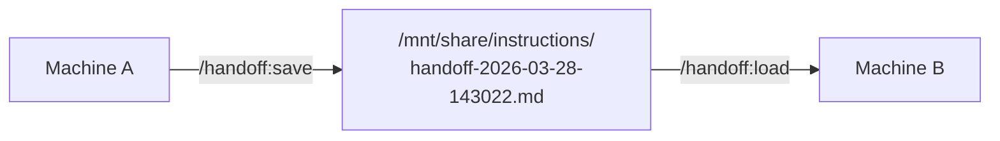

# handoff

Save and load task context across machines via a shared network drive.

## Summary

When infrastructure work requires physically moving between machines (SSH is down, a console change is needed, a different Claude Code session picks up the task), context gets lost. Handoff writes a structured markdown file to a shared network path with everything needed to resume: what was done, where things stand, and exactly what to do next. On the other machine, `/handoff:load` reads the latest file and presents the next steps.

## Principles

**[P1] Complete Context**: The handoff file contains everything the receiving session needs. No "see previous conversation" references, no assumed context. The reader has zero history.

**[P2] Actionable Next Steps**: The most important section is Next Steps. It should be specific enough that the receiving Claude Code instance can begin work immediately without clarification.

## Requirements

- Claude Code (any recent version)
- Shared network path mounted at `/mnt/share/instructions/`

## Installation

```bash
/plugin marketplace add L3DigitalNet/Claude-Code-Plugins
/plugin install handoff@l3digitalnet-plugins
```

## How It Works



## Usage

On the source machine, when you need to hand off to another machine:

```
/handoff:save networking cleanup
```

This writes a file like `networking-cleanup-2026-03-28-143022.md` to the shared drive with task summary, current state, and next steps.

On the destination machine:

```
/handoff:load
```

This reads the most recent handoff file and presents the next steps. To load a specific file:

```
/handoff:load networking-cleanup-2026-03-28-143022.md
```

## Skills

| Skill | Invoked by |
|-------|------------|
| `save` | `/handoff:save` |
| `load` | `/handoff:load` |

## Planned Features

- List available handoff files with `/handoff:list`
- Auto-cleanup of handoff files older than 7 days

## Known Issues

- The shared path `/mnt/share/instructions/` is hardcoded. If your mount point differs, edit the SKILL.md files directly.
- No locking mechanism; if two machines save simultaneously, both files are preserved (unique timestamps) but neither knows about the other.

## Links

- Repository: [L3DigitalNet/Claude-Code-Plugins](https://github.com/L3DigitalNet/Claude-Code-Plugins)
- Changelog: [`CHANGELOG.md`](CHANGELOG.md)
- Issues and feedback: [GitHub Issues](https://github.com/L3DigitalNet/Claude-Code-Plugins/issues)
